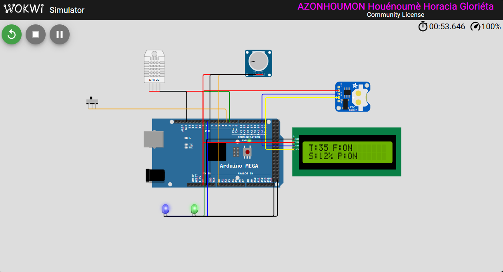
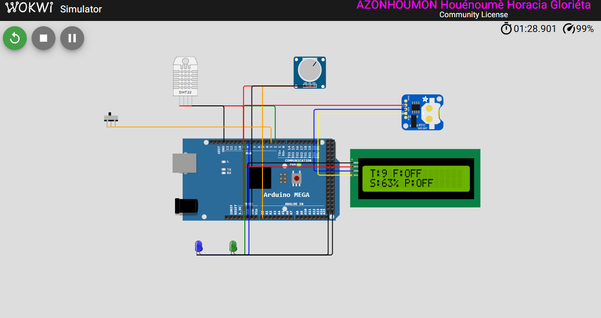
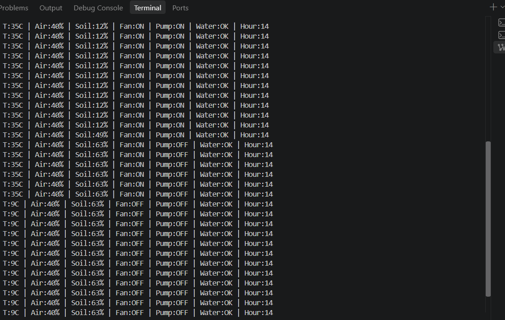

# Serre automatisée sur ATmega2560

[](https://github.com/HoraEmbedded/Projets_GSEAs/actions/workflows/ci-greenhouse.yml)

Firmware bare-metal, sans système d'exploitation, pour la gestion autonome d'une serre : température et humidité de l'air (DHT22), humidité du sol (ADC), ventilateur et pompe pilotés par hystérésis, seuils reconfigurables par commandes série et persistés en EEPROM.

La logique de décision n'accède à aucun registre. Elle se compile et se teste sur PC avec `gcc`, sans carte.

## Le firmware en marche

| Seuil chaud, sol sec | Seuil froid, sol humide |
|---|---|
|  |  |
| 35 °C, sol à 12 % : ventilateur et pompe commandés | 9 °C, sol à 63 % : les deux actionneurs retombent |



Télémétrie série : la pompe coupe dès que le sol repasse au-dessus du seuil haut, le ventilateur ne commute qu'après franchissement du seuil de température, sans oscillation à la bascule.

## Chiffres

| Mesure | Valeur |
|---|---|
| Tests sur hôte | 12 suites, 98 cas |
| Couverture de lignes et de fonctions | 100 % |
| Couverture de branches | 93,5 % (86/92, le reste inatteignable) |
| Pire cas de pile | 63 octets sur 8 192 |
| Flash | ≈ 4,1 Ko sur 253 952 |
| RAM statique | 425 octets sur 8 192 |
| Durée de vie EEPROM | > 50 ans en usage normal, 1 an sous écriture continue |

Le pire cas de pile est obtenu par désassemblage du binaire. La durée de vie EEPROM est calculée à partir du nombre de cycles garanti et de la fréquence d'écriture réelle (`tools/eeprom_lifetime.py`).

## Sûreté de fonctionnement

- Watchdog matériel.
- Dégradation gracieuse après pannes répétées du DHT22 : les actionneurs passent dans un état sûr plutôt que de suivre une mesure fausse.
- Deux gardes indépendantes sur la pompe : niveau d'eau du réservoir et fenêtre horaire diurne.
- Configuration EEPROM protégée par octet magique et somme de contrôle XOR ; retour aux valeurs d'usine si la lecture échoue.

## Matériel

| Composant | Rôle | Interface |
|---|---|---|
| DHT22 | Température et humidité de l'air | 1-Wire, broche 2 |
| Potentiomètre | Simule une sonde d'humidité du sol | ADC, A0 |
| DS1307 | Horloge temps réel, irrigation de jour uniquement | I2C (0x68), partagé avec l'écran |
| Interrupteur à flotteur | Niveau d'eau du réservoir | Numérique, broche 3 |
| LCD 1602 | Affichage local | I2C (0x27) |
| LED bleue et verte | Simulent les relais pompe et ventilateur | Numérique, broches 8 et 9 |

## Architecture logicielle

Couche matérielle, accès registre, non portable :

| Module | Rôle |
|---|---|
| `ring_buffer.c` | Réception UART par interruption |
| `dht22_decode.c` | Décodage de la trame 1-Wire du DHT22 |
| `rtc_decode.c` | Décodage BCD de l'horloge DS1307 |
| `soil.c` | Conversion ADC vers pourcentage d'humidité |

Couche de décision, C portable, couverte par les tests hôte :

| Module | Rôle |
|---|---|
| `hysteresis.c` | Décision ventilateur et pompe, bande morte |
| `thresholds.c` | Validation des seuils |
| `schedule.c` | Garde horaire jour / nuit sur l'irrigation |
| `water_level.c` | Garde niveau d'eau sur la pompe |
| `fault_handling.c` | Dégradation après pannes répétées du capteur |
| `command.c` | Analyseur de commandes série |
| `eeprom_config.c` | Persistance, octet magique et somme de contrôle |

## Commandes série

| Commande | Effet |
|---|---|
| `GET` | Renvoie les seuils courants et l'état des actionneurs |
| `SET <clé> <valeur>` | Modifie un seuil, valide la plage, écrit en EEPROM |
| `RESET` | Restaure les seuils d'usine |

## Faire tourner le projet

```bash
# Firmware sur cible
pio run
pio run --target upload

# Tests unitaires et couverture, sur PC, sans carte
cd test/host && make run && make coverage

# Analyse statique et pire cas de pile
cppcheck --enable=warning,style,performance,portability \
         --inconclusive --std=c11 -Isrc src/*.c
python tools/stack_analysis.py

# Durée de vie EEPROM
python tools/eeprom_lifetime.py

# Télémétrie, capture automatisée via Wokwi
cd tools/telemetry
pip install -r requirements.txt
python generate_drift_scenario.py --output drift_scenario.yaml
python capture_and_plot.py --scenario drift_scenario.yaml --duration 100
```

L'intégration continue rejoue à chaque commit : build, tests, couverture, analyse statique, analyse de pile, capture de télémétrie.


## Ce qui reste à faire

- **Sonde de sol réelle.** Le potentiomètre sera remplacé par une sonde capacitive, avec courbe de calibration relevée au banc et coefficients rangés en EEPROM.
- **Validation sur carte physique.** Wokwi émule l'ATmega2560 et exécute le binaire compilé, ce qui exerce réellement le code d'accès aux registres et le décodage des trames capteur. Restent à éprouver sur matériel : les timings analogiques, le bruit sur l'ADC, l'alimentation et les appels de courant des actionneurs, les perturbations du relais.
- **Fenêtre horaire configurable.** Le créneau jour / nuit est aujourd'hui une constante de compilation ; il doit rejoindre les seuils réglables par commande `SET` et persistés en EEPROM.
- **Portage sur RTOS.** Le cœur de décision est déjà indépendant du matériel : le porter sur Zephyr permettrait d'éprouver ce découplage sur un autre build system et un autre ordonnanceur, sans toucher à la logique.

---

Horacia Azonhoumon, élève ingénieure GSEA, ENSA Tanger.
[hora-portfolio.vercel.app](https://hora-portfolio.vercel.app/) · [@HoraEmbedded](https://github.com/HoraEmbedded)
