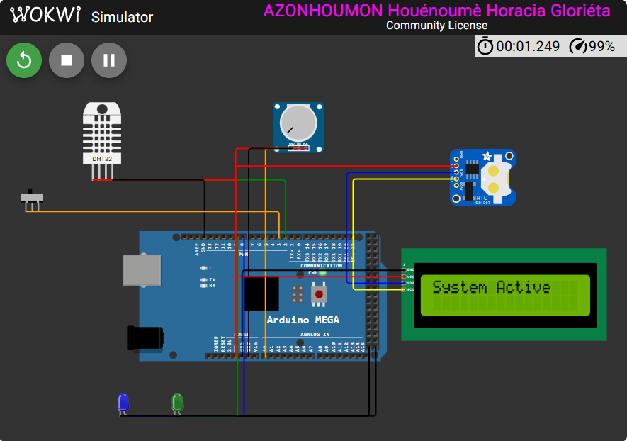
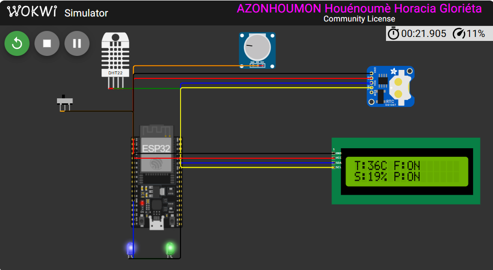

# Centrale de régulation : de l'ATmega2560 à l'ESP32 IoT

[](https://github.com/HoraEmbedded/greenhouse-avr/actions/workflows/ci.yml)
[](https://github.com/HoraEmbedded/greenhouse-avr/actions/workflows/v2_esp32_ci.yml)

Monorepo retraçant l'évolution complète d'une centrale de régulation critique pour serre. Le projet présente deux générations d'architecture : un firmware bare-metal en C pour ATmega2560 (V1), puis une migration vers une architecture IoT basée sur ESP32 et FreeRTOS (V2).

## Démonstrations

### V1 : Serre automatisée sur ATmega2560

[](https://youtu.be/q6eLAhxcG84)

Firmware bare-metal, régulation par hystérésis, gardes pompe indépendantes, commandes série persistées en EEPROM.

### V2 : Serre connectée sur ESP32

[](https://www.youtube.com/watch?v=1_EZUG0B92Y)

Architecture FreeRTOS, MQTT sur TLS, télémétrie JSON vers broker Cloud.

## Le problème initial

La gestion d'une serre repose sur des paramètres critiques : température, humidité de l'air et du sol. Une défaillance peut entraîner des pertes de récolte. Un système de régulation doit donc être fiable, prévisible, et capable de fonctionner en autonomie tout en signalant les anomalies.

## La solution : deux générations, une même rigueur

### V1 : Maîtrise du temps réel contraint

La première version a été conçue comme un exercice de style bare-metal :
- **Firmware C pur** sans framework Arduino, drivers écrits depuis la datasheet.
- **Super-boucle non bloquante** avec sommeil IDLE et watchdog matériel.
- **Régulation par hystérésis** pour le ventilateur (26/24 °C) et la pompe (30/60 %).
- **Deux gardes indépendantes** sur la pompe : niveau d'eau et irrigation diurne uniquement.
- **Validation rigoureuse** : 12 suites de tests hôte, 98 cas, 100 % de couverture lignes et fonctions, analyse de pile par désassemblage réel (63/8192 octets, 99,2 % de marge).

### V2 : L'extension IoT sécurisée

La deuxième version conserve la logique métier et l'étend vers le Cloud :
- **Architecture FreeRTOS** : 4 tâches préemptives (Sensors, Logic, Network, Display) réparties sur 2 cœurs.
- **Communication inter-tâches** par Queues et Mutex pour protéger le bus I2C.
- **Chaîne Edge-to-Cloud sécurisée** : Wi-Fi WPA2, MQTT sur TLS 1.2/1.3, authentification par Root CA, payload JSON.
- **Double environnement PlatformIO** : simulation Wokwi et carte ESP32 réelle.
- **Isolation des secrets** : `secrets.h` non versionné, template `.example` fourni pour la CI.

Le cœur de décision reste en **C pur**, portable et testable sur PC, indépendamment de la cible matérielle.

## Difficultés rencontrées

- **Portage des drivers** : le protocole 1-Wire du DHT22, sensible au timing, ne fonctionnait pas correctement dans le simulateur Wokwi. Solution : deux implémentations distinctes (bit-bang pour le matériel, DHTesp pour la simulation) sélectionnées par filtre de sources PlatformIO.
- **Synchronisation des tâches** : le partage du bus I2C entre la RTC, le LCD et les capteurs nécessitait un Mutex pour éviter les conflits d'accès.
- **Gestion des secrets** : la configuration CI devait générer un `secrets.h` factice à partir d'un template pour compiler l'environnement matériel sans exposer les vrais identifiants.
- **Limites de la simulation** : Wokwi gratuit ne ponte pas le Wi-Fi vers Internet, ce qui empêche la validation Cloud en simulation.

## Perspectives

- Validation du client MQTT/TLS sur une carte ESP32 physique.
- Ajout de QoS 1/2 pour une fiabilité industrielle (via ESP-MQTT).
- Configuration de la fenêtre horaire jour/nuit en EEPROM.
- Intégration d'un dashboard Cloud (HiveMQ Web Client ou Grafana).
- Ajout d'un mode économie d'énergie avec réveil périodique.

## Contenu du dépôt

| Dossier | Description |
|---|---|
| [`firmware_v1_bare_metal/`](firmware_v1_bare_metal/) | V1 : firmware C pur sur ATmega2560, drivers depuis la datasheet |
| [`firmware_v2_rtos_iot/`](firmware_v2_rtos_iot/) | V2 : migration ESP32 + FreeRTOS, MQTT/TLS, double environnement |

## Comparaison V1 / V2

| | V1 Bare-metal | V2 RTOS / IoT |
|---|---|---|
| Cible | ATmega2560, 8 bits | ESP32, 32 bits dual-core |
| Architecture | Super-boucle non bloquante | 4 tâches FreeRTOS préemptives |
| Communication | Modules C appelés en séquence | Queues et mutex inter-tâches |
| Réseau | Aucun | Wi-Fi WPA2, MQTT sur TLS 1.2/1.3 |
| Sécurité | Watchdog, checksum, EEPROM | Watchdog, TLS, Root CA, secrets isolés |
| Tests hôte | 12 suites, 98 cas | 4 suites, 11 cas |
| CI | 6 jobs | 4 jobs |
| Simulation | Wokwi CLI | Wokwi CLI |
| Sortie locale | LCD 1602 I2C | LCD 1602 I2C |
| Sortie distante | Port série | Broker Cloud HiveMQ |

## Démarrage rapide

### V1

```bash
cd firmware_v1_bare_metal
pio run
```

### V2, simulation

```bash
cd firmware_v2_rtos_iot
pio run -e esp32dev_wokwi
wokwi-cli .
```

La documentation détaillée de chaque version est disponible dans son dossier respectif.

## Auteur

Projet personnel réalisé par Horacia Azonhoumon.

Une fois ces étapes faites, n'importe qui visitant ton dépôt verra immédiatement l'histoire du projet, les vidéos de démonstration, et les liens vers les deux versions. C'est exactement ce qu'un recruteur veut voir.
