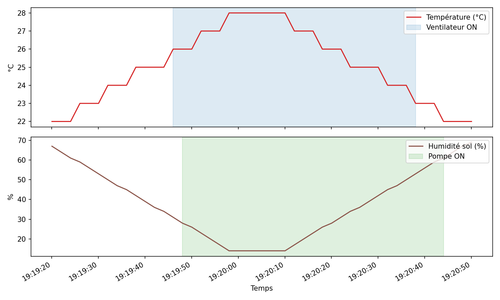

# Système Embarqué de Gestion de Serre Intelligente (Validation par Simulation)

[](https://github.com/<utilisateur>/<depot>/actions/workflows/ci.yml)

## Description du Projet
Ce projet consiste en la conception et l'implémentation d'un micrologiciel de contrôle automatisé pour une serre agricole. Le code est développé intégralement en C pur (approche *bare-metal*) pour l'architecture AVR (ATmega2560), garantissant une exécution déterministe et non-bloquante via une gestion par interruptions matérielles.

Afin de valider la logique de commande (hystérésis) et l'intégrité des communications bas niveau (I2C, 1-Wire, ADC) avant le déploiement matériel, l'intégralité du système a été modélisée et testée sur l'environnement de simulation industrielle **Wokwi**.

---

## Modélisation de l'Environnement Virtuel (Wokwi)
Dans le cadre de la simulation, les composants physiques de puissance ont été substitués par des modèles virtuels équivalents pour valider les signaux électriques générés par le microcontrôleur. La topologie est définie dans le fichier `diagram.json`.

### Rôle des Composants Simulés
* **ATmega2560 (`wokwi-arduino-mega2560`) :** Cœur du système. Il exécute le fichier binaire `.hex` généré par le compilateur AVR-GCC et gère les registres matériels virtuels.
* **Afficheur LCD I2C (`wokwi-lcd1602-i2c`) :** Modélise l'écran physique et son module PCF8574. Permet de valider l'implémentation logicielle du protocole TWI/I2C (adressage `0x27`) et l'affichage de l'IHM.
* **Capteur DHT22 (`wokwi-dht22`) :** Simule les variations environnementales de l'air. Il répond aux requêtes du microcontrôleur en générant les chronogrammes stricts du protocole 1-Wire (impulsions de 40 µs à 80 µs).
* **Potentiomètre Linéaire (`wokwi-potentiometer`) :** Remplace la sonde capacitive d'humidité du sol. Il agit comme un diviseur de tension modifiant le signal de 0V à 5V sur la broche `A0`, permettant de valider la configuration du convertisseur analogique-numérique (ADC).
* **LEDs de Signalisation (`wokwi-led`) et Résistances :** Remplacent les modules relais électromécaniques 5V. 
  * La **LED Bleue** (broche 8) valide la tension haute (5V) modélisant la fermeture du contacteur de la **pompe d'irrigation**.
  * La **LED Verte** (broche 9) valide la tension haute (5V) modélisant la fermeture du contacteur du **ventilateur**.

 

  
---

## Architecture Logicielle (Pilotes *Bare-Metal*)
Le projet n'utilise aucune bibliothèque externe. Les pilotes suivants ont été écrits via la manipulation directe des registres :

1. **Cadencement par interruption :** Le Timer 1 est configuré en mode CTC (prescaler de 1024) pour déclencher une interruption `TIMER1_COMPA_vect` toutes les 2 secondes, qui ne fait que lever un drapeau (`measure_flag`). C'est cette étape de cadencement qui est non-bloquante ; le traitement qui suit (lecture DHT22, écriture LCD) reste volontairement séquentiel, voir "Décisions de conception" plus bas.
2. **UART :** Configuration des registres `UBRR0` et `UCSR0` pour la télémétrie asynchrone (9600 bauds).
3. **I2C (TWI) :** Gestion du registre `TWCR` pour cadencer l'horloge SCL à 100 kHz.
4. **ADC :** Configuration de l'échantillonnage avec un facteur de division de 128 via `ADCSRA`.

---

## Décisions de conception

- **ATmega2560, pas un Uno/328P** : le projet utilise trois périphériques matériels simultanément (UART, TWI/I2C, ADC) plus un timer dédié — le 2560 offre plus de RAM et de broches pour étendre le système (plusieurs capteurs, écran) sans reconfiguration.
- **Lecture bloquante déclenchée par interruption, pas 100 % asynchrone** : l'interruption Timer1 ne fait que lever un drapeau toutes les 2 s, ce qui est la partie réellement non-bloquante. La lecture du DHT22 et l'écriture LCD qui suivent sont volontairement bloquantes : rien d'autre ne doit s'exécuter pendant ces quelques millisecondes, donc l'attente active est un choix simple et suffisant, pas une architecture temps réel complète.
- **Hystérésis à seuils dissociés (ON/OFF différents)** plutôt qu'un seuil unique : un seuil unique ferait claquer le relais à chaque mesure quand la valeur oscille autour de lui. La bande morte (2 °C, 30 points de %) absorbe le bruit de mesure normal du DHT22.
- **Logique de décision extraite dans `hysteresis.c`**, sans aucun accès registre : elle compile et se teste avec un `gcc` hôte ordinaire (`test/host/`), indépendamment du firmware AVR. Un bug de seuil se détecte donc sans carte, sans simulateur, en une fraction de seconde.

## Analyse du pire cas d'utilisation de la pile

```bash
cd tools
python stack_analysis.py
```

Sur un microcontrôleur sans MMU, un débordement de pile est un bug silencieux -- il corrompt les variables globales adjacentes sans crash immédiat. Ce script borne formellement la profondeur maximale, à partir des vrais chiffres du compilateur (`avr-gcc -fstack-usage`), pas d'une estimation :

| | Octets |
|---|---|
| Chaîne d'appel la plus profonde (`main → lcd_print_int → lcd_send → lcd_send_nibble → i2c_start`) | 44 |
| + Interruption la plus coûteuse au pire moment (préemption) | 19 |
| **Pire cas total** | **63** |
| SRAM disponible (ATmega2560) | 8192 |
| **Marge restante** | **8129 (99,2 %)** |

Le firmware a deux sources d'interruption (Timer1 pour la cadence de mesure, USART0 RX pour la réception série) -- comme aucune des deux ne se réautorise elle-même (`sei()` n'est jamais appelé dans une ISR), elles ne peuvent jamais s'exécuter simultanément : le pire cas retient la **plus coûteuse des deux**, pas leur somme.

Trois points vérifiés, pas supposés :
- **Le graphe d'appel est tracé à la main depuis le code source**, chaque arête commentée avec la ligne qui la justifie -- je n'ai pas fait confiance à une analyse automatique par expressions régulières, pour la même raison que `NC-015` de Sentinelle se méfie d'un instrument de mesure non vérifié.
- **Le coût de chaque interruption est vérifié par désassemblage** (`avr-objdump -d`), pas déduit du chiffre du compilateur seul : sur l'ATmega2560 (256 Ko de Flash, au-delà de la limite de 128 Ko), l'adresse de retour empilée par le matériel fait 3 octets (pas 2, comme sur les petits AVR). Timer1 pousse 4 octets de registres en plus (3+4=7).
- **Aucune fonction n'est signalée à usage de pile non borné** (`static` partout dans la sortie `-fstack-usage`, pas `dynamic`) -- confirmation qu'il n'y a ni récursion ni tableau à taille variable qui échapperait à cette analyse.

**Une leçon de compilateur imprévue, trouvée en vérifiant plutôt qu'en supposant** : le coût de l'ISR USART0 RX n'est pas une propriété fixe du code source. Il est passé de 12 à 19 octets après un changement d'une ligne dans une fonction complètement différente (`lcd_set_cursor`, sans aucun rapport avec l'UART) -- vérifié par désassemblage : 9 registres explicitement poussés dans un cas, 16 dans l'autre. La raison : GCC décide d'*inliner* `ring_buffer_push()` dans l'ISR ou d'émettre un vrai appel de fonction selon un modèle de coût qui évalue **tout le fichier**, pas seulement la fonction modifiée -- réduire une fonction ailleurs peut faire basculer une décision d'inlining totalement différente. Concrètement : **le pire cas de pile est une propriété du binaire compilé, pas du code source lu isolément**, et c'est précisément pour cette raison que ce script recompile à chaque exécution au lieu de mettre en cache un chiffre -- et pourquoi le job CI `stack-analysis` doit tourner à chaque modification, pas une fois pour toutes.

Marge de 99,2 % : sans risque réel ici, mais la méthode est ce qui compte -- c'est la même utilisée dans `tools/stack_wcs.py` de Sentinelle.

## Réception UART en interruption

La réception série ne scrute plus le registre matériel depuis la boucle principale -- elle est pilotée par interruption (`USART0_RX_vect`), avec un tampon circulaire de 32 octets (`src/ring_buffer.c`, testé indépendamment de l'AVR : FIFO, retour à zéro d'indice sur des centaines de cycles, compteur de débordement qui sature à 255 au lieu de boucler silencieusement à 0).

Pourquoi ce n'est pas cosmétique : `dht_read()` désactive les interruptions jusqu'à ~260 µs dans son pire cas (voir plus haut), et la boucle principale scrute par ailleurs plusieurs registres à chaque tour. Avec une simple scrutation de `UDR0`, un octet arrivant pendant une de ces fenêtres pouvait être silencieusement écrasé par l'octet suivant avant d'être lu. L'interruption capture chaque octet à l'instant où il arrive, indépendamment de ce que fait `main()`.

L'ISR elle-même ne contient plus aucune logique propre à elle -- juste `ring_buffer_push(UDR0)` -- toute la logique testable (remplissage, dépassement, ordre FIFO) vit dans `ring_buffer.c` et est vérifiée sur l'hôte, sans microcontrôleur.

## Mode veille (SLEEP_MODE_IDLE)

La boucle principale ne fait plus d'attente active entre deux mesures (jusqu'à 2 s à ne rien faire, sur batterie ce n'est pas neutre). Le firmware appelle `sleep_cpu()` en `SLEEP_MODE_IDLE` dès qu'il n'y a ni commande série en attente ni mesure à traiter, et se réveille sur l'interruption Timer1 (cadence de mesure) ou sur un octet UART entrant.

**Pourquoi `SLEEP_MODE_IDLE` précisément** : c'est le seul mode qui laisse tourner à la fois Timer1 *et* l'USART (pour la réception série) sans changement d'horloge -- un mode plus profond (`SLEEP_MODE_PWR_DOWN`) couperait aussi l'horloge de l'USART, rendant la réception de commandes silencieusement impossible pendant le sommeil.

**Une course évitée, pas juste un `sleep_cpu()` jeté dans la boucle** : la séquence est `cli()` → vérifier s'il y a du travail → `sleep_enable(); sei(); sleep_cpu();`. Sans ce `cli()` initial, une interruption pourrait arriver exactement entre la vérification et l'endormissement, et ce réveil serait perdu jusqu'à la prochaine interruption (jusqu'à 2 s plus tard pour une commande qui aurait dû répondre immédiatement). La garantie AVR est que l'instruction juste après un `sei()` s'exécute toujours avant qu'une interruption en attente ne soit servie -- **vérifié par désassemblage** (`avr-objdump -d`) que `sei` et `sleep` sont bien deux instructions strictement consécutives dans le binaire compilé, pas seulement dans le code source.

### Budget de consommation -- ce qui est vérifié, et ce qui ne l'est pas

Honnêtement : je n'ai pas pu récupérer le tableau exact de consommation du datasheet ATmega2560 (le PDF officiel bloque l'accès automatisé, et les résumés en ligne ne citent pas les chiffres précis Actif/Idle à 16 MHz). Plutôt que d'inventer un chiffre plausible, voici ce que j'ai trouvé de réellement sourcé, et pourquoi ça change la conclusion :

Une mesure publiée (Gammon Forum, une référence reconnue en mesure de consommation AVR) sur une **carte Arduino Mega 2560 complète** (pas la puce nue) donne : **~68 mA** en fonctionnement normal, et seulement **~24 mA** même dans le mode de veille le *plus profond* possible (`SLEEP_MODE_PWR_DOWN`, plus agressif que ce que ce firmware utilise).

**Ce que ça signifie concrètement pour ce projet** : sur une carte Mega du commerce, une bonne partie de ces ~68 mA ne vient pas du microcontrôleur lui-même, mais de composants que le mode veille ne peut pas toucher -- la puce USB-série embarquée, la LED d'alimentation, le courant de repos du régulateur de tension. Mettre l'ATmega2560 en `SLEEP_MODE_IDLE` (plus léger que ce qui a été mesuré ci-dessus) réduit la consommation du firmware, mais le gain réel sur une carte Mega non modifiée sera nettement plus modeste que ce qu'un tableau "actif vs. veille" du datasheet de la puce seule pourrait suggérer.

**Pour un chiffre fiable sur ton propre montage**, la bonne méthode -- celle que j'appliquerais moi-même si j'avais la carte sous la main -- est de mesurer, pas de calculer depuis une fiche technique :
1. Multimètre en série sur l'alimentation 5V, entre la source et la carte.
2. Relever le courant en fonctionnement normal (mesure en cours), puis pendant une phase où le firmware est en veille (entre deux cycles de 2 s).
3. Courant moyen ≈ `(I_actif × t_actif + I_veille × t_veille) / (t_actif + t_veille)`, avec `t_actif` mesuré (durée réelle d'un cycle de mesure complet, de l'ordre de quelques ms d'après le calcul du pire cas de pile) et `t_veille` ≈ 2 s.
4. Autonomie estimée = capacité de la batterie (mAh) / courant moyen (mA).

Pour aller plus loin en pratique (et obtenir un vrai gain mesurable, pas seulement le mode veille du firmware) : retirer/désactiver la LED d'alimentation et la puce USB-série de la carte, ou passer à une carte ATmega2560 nue sur circuit dédié avec un régulateur à faible courant de repos -- c'est là que se trouve la plus grande partie du gain réel, pas uniquement dans le firmware.

## Analyse statique (cppcheck)

```bash
cppcheck --enable=warning,style,performance,portability --inconclusive --std=c11 -Isrc src/*.c
```

Intégré à la CI (`static-analysis`), qui échoue sur tout avertissement -- pas seulement les erreurs. Un vrai résultat obtenu avant d'écrire cette section : `lcd_set_cursor` construisait un tableau local à chaque appel alors que son contenu ne change jamais (`row_offsets`) -- corrigé en `static const`, ce qui l'a sorti de la pile de la fonction (et accessoirement déclenché la leçon sur l'inlining décrite ci-dessus).

## Durée de vie de l'EEPROM

```bash
cd tools
python eeprom_lifetime.py --commands-per-day 20
```

L'ATmega2560 supporte 100 000 cycles d'écriture/effacement par cellule EEPROM (datasheet) -- mais `eeprom_config_save()` utilise `eeprom_update_*` partout, qui ne réécrit un octet que s'il change réellement. Résultat : **les octets ne s'usent pas au même rythme**.

- **L'octet magique** ne change jamais après la toute première sauvegarde -- écrit une seule fois, pour toute la vie de l'appareil.
- **Les 6 octets de seuils** ne prennent une vraie écriture que lorsque leur propre champ change (`SET FAN_ON` ne touche que les octets de `fan_on_decidegC`, pas les 4 autres).
- **Le checksum est l'octet qui s'use le plus vite -- et ce n'est pas une supposition, c'est prouvé par l'algèbre** : c'est un XOR sur les 6 octets de seuils, et pour tout octet `b` qui change vers `b'` (`b ≠ b'`), `b XOR b' ≠ 0` toujours -- vérifié empiriquement sur 100 000 essais aléatoires en plus de la preuve algébrique. Le checksum change donc à chaque `SET`/`RESET` qui modifie réellement un seuil, plus souvent que n'importe quel octet de seuil pris isolément.

| Usage | Commandes/jour | Durée avant la limite |
|---|---|---|
| Normal | 5 | ~55 ans |
| Intensif | 50 | ~5 ans |
| Abus délibéré | 500 | ~1 an |

Même dans le scénario le plus pessimiste raisonnable, la marge est confortable pour la durée de vie réelle du produit.

## Watchdog matériel

Le firmware active le watchdog matériel de l'ATmega2560 (`wdt_enable(WDTO_2S)`) une fois l'initialisation terminée, et le "nourrit" (`wdt_reset()`) à chaque tour de la boucle principale. Si le firmware se bloque -- boucle infinie, état corrompu -- l'appareil redémarre seul en moins de 2 secondes, sans intervention humaine.

Le délai de 2 s n'est pas arbitraire : le pire cas mesuré de `dht_read()` (toutes ses attentes de timeout cumulées, si le capteur ne répond jamais comme attendu) est d'environ 260 ms -- une marge de plus de 7x avant que le watchdog ne s'inquiète d'une opération pourtant normale.

**Note technique** : la désactivation du watchdog tout en haut de `main.c` (`wdt_init()`, section `.init3`) doit rester intacte -- elle évite qu'un redémarrage causé par le watchdog lui-même ne reboucle indéfiniment, un piège classique sur AVR.

## Comportement en cas de panne capteur

- **La pompe ne dépend plus jamais du DHT22.** L'humidité du sol vient de l'ADC (potentiomètre en simulation, sonde capacitive en réel), un circuit totalement indépendant du capteur d'air. Avant cette correction, une panne du DHT22 gelait aussi silencieusement l'irrigation -- ce n'était jamais nécessaire.
- **Le ventilateur, lui, dépend réellement de la température.** Une lecture DHT22 manquée isolée ne change rien (probable glitch de timing sur le bus 1-Wire) : le dernier état connu est conservé. Mais après **5 échecs consécutifs** (~10 s sans donnée), le firmware ne peut plus faire confiance à cet état et **force le ventilateur en marche**, plutôt que de le laisser dans un état qui pourrait dater d'avant une vraie surchauffe.
- **Ce choix (forcer ON, pas OFF) est un compromis de sûreté assumé** : une serre qui surchauffe peut tuer les plantes en moins d'une heure ; un ventilateur qui tourne un peu plus que nécessaire ne coûte que de l'électricité. Entre les deux modes de défaillance, celui-ci privilégie le réversible.
- Le seuil (`DHT_FAILURE_SAFETY_THRESHOLD`, 5 cycles) est isolé dans `fault_handling.h` et testé indépendamment (`test/host/test_fault_handling.c`).

## Limites connues

- **Le capteur d'humidité du sol est simulé par un potentiomètre linéaire** (`diagram.json`). La conversion (`soil.c`) est calibrée sur ce comportement idéal (0 → 0 %, 1023 → 100 %). Une vraie sonde capacitive n'est pas linéaire sur toute sa plage et est souvent de polarité inverse (valeur brute plus haute quand c'est plus sec). Les deux constantes de calibration sont isolées dans `soil.h` précisément pour être remesurées sur le vrai capteur avant tout déploiement.
- **Aucun test sur silicium réel** : tout est validé en simulation Wokwi et par tests hôte sur la logique pure. Le comportement électrique réel (bruit sur l'ADC, timing DHT22 sur un vrai bus) reste à vérifier sur carte.
- **La lecture DHT22 désactive les interruptions pendant quelques millisecondes** (`cli()`/`sei()` dans `dht_read()`) pour garantir un timing fiable sur le protocole 1-Wire. Ce n'est plus anodin depuis l'ajout de la réception UART par interruption : un octet série qui arriverait pendant cette fenêtre est retardé, pas perdu (le firmware le traite dès la sortie de `dht_read()`), mais ça vaut d'être su si d'autres interruptions à échéance plus courte étaient ajoutées un jour.

## Sécurité de l'irrigation (niveau d'eau + horloge temps réel)

Deux gardes supplémentaires s'appliquent à la pompe, chacune capable d'annuler la décision de l'hystérésis -- comme la vérification du niveau d'eau et le contrôle horaire ne dépendent d'aucun autre capteur, les deux s'appliquent aussi bien en fonctionnement normal qu'en panne DHT22.

### Capteur de niveau d'eau (interrupteur à flotteur)

Broche 3 (PE5), entrée avec pull-up interne. Câblage pensé pour qu'une panne soit sûre par défaut : le fil coupé ou déconnecté se lit comme "eau absente" (HIGH via le pull-up), pas comme "eau présente" -- un défaut de câblage bloque l'arrosage plutôt que de laisser la pompe tourner sans surveillance.

```c
uint8_t pump_output_state(uint8_t hysteresis_pump_state, uint8_t water_present);
```

Fonction pure (`src/water_level.c`), testée indépendamment du GPIO (`test/host/test_water_level.c`) : si l'eau n'est pas confirmée présente, la pompe est forcée à l'arrêt, quelle que soit l'assèchement du sol. C'est une inversion de priorité assumée -- la sécurité matérielle (ne pas faire tourner une pompe à sec) passe avant le calendrier d'arrosage.

En simulation, un interrupteur à glissière (`wokwi-slide-switch`) tient lieu de flotteur.

### Horloge temps réel (DS1307) -- irrigation le jour uniquement

**Pourquoi le DS1307 et pas le DS3231** (plus précis, plus courant) : Wokwi simule nativement le DS1307 (`wokwi-ds1307`, documenté sur docs.wokwi.com), alors que le DS3231 n'est disponible que via des puces personnalisées communautaires non officielles. Choix fait pour la fiabilité de la simulation, pas par méconnaissance du DS3231 -- les deux partagent la même disposition de registres pour l'heure (BCD, registre 0x02), donc le portage vers un DS3231 réel ne changerait que l'adresse I2C si besoin.

La RTC partage le même bus I2C que l'écran LCD (broches 20/21) -- deux appareils, deux adresses (`0x27` pour l'écran, `0x68` pour la RTC), un seul bus, comme en I2C réel.

```c
#define DAYTIME_START_HOUR 6
#define DAYTIME_END_HOUR   20
uint8_t is_daytime(uint8_t hour);
```

Arroser du feuillage qui reste humide toute la nuit (pas de soleil, température plus basse, évaporation plus lente) favorise les maladies fongiques dans une vraie serre -- ce n'est pas un horaire arbitraire, c'est une contrainte agronomique. En dehors de la fenêtre `[6h, 20h)`, la pompe est forcée à l'arrêt, même si le sol est sec et l'eau disponible.

Deux fonctions pures testées séparément : `bcd_to_decimal()` (`src/rtc_decode.c`) décode le format BCD des registres DS1307 -- testé spécifiquement contre le piège classique de le confondre avec du binaire pur (`0x23` vaut 23 en BCD, pas 35) ; `is_daytime()` (`src/schedule.c`) teste les deux bornes de la fenêtre.

**Limite assumée** : les horaires de la fenêtre jour/nuit sont des constantes de compilation, pas encore configurables via EEPROM/série comme les autres seuils -- une extension naturelle mais qui aurait élargi cette étape au-delà de sa portée initiale.

La télémétrie série inclut maintenant `Water:OK|LOW` et `Hour:<0-23>` sur chaque ligne.

## Seuils configurables (EEPROM + commandes série)

## Seuils configurables (EEPROM + commandes série)

Les seuils d'hystérésis (allumage/extinction ventilateur et pompe) ne sont plus figés dans le code : ils sont chargés depuis l'EEPROM au démarrage, et modifiables à chaud via le port série (9600 bauds), sans reflasher le firmware.

**Commandes disponibles :**

| Commande | Effet |
|---|---|
| `GET` | Affiche les 4 seuils actuels |
| `SET FAN_ON <dixièmes de °C>` | Ex. `SET FAN_ON 275` pour 27,5 °C |
| `SET FAN_OFF <dixièmes de °C>` | |
| `SET PUMP_ON <%>` | |
| `SET PUMP_OFF <%>` | |
| `RESET` | Restaure les valeurs d'usine et les sauvegarde |

Toute commande `SET` qui rendrait la bande morte invalide (seuil ON du ventilateur ≤ seuil OFF, par exemple) est **rejetée** avant d'atteindre les actionneurs — la validation (`thresholds.c`) est testée indépendamment de la persistance et de la lecture série.

**Robustesse EEPROM** : un octet magique et un checksum XOR détectent une puce vierge ou une écriture interrompue par une coupure de courant ; dans les deux cas, le firmware retombe sur les valeurs d'usine plutôt que de faire confiance à des données partielles.

## Outil de télémétrie (tools/telemetry/)

Le firmware envoie déjà sa télémétrie sur le port série toutes les 2 secondes. Ces scripts la capturent, l'enregistrent, et la visualisent -- rien côté firmware n'a changé.

### Capture manuelle (carte réelle, ou copier-coller depuis Wokwi)

```bash
pip install -r tools/telemetry/requirements.txt

# Carte réelle, sur un vrai port série (Ctrl+C pour arrêter)
python tools/telemetry/logger.py --port COM5 --output telemetry.csv

# Ou depuis un texte copié du moniteur série de Wokwi
python tools/telemetry/logger_from_file.py --input captured_serial.txt --output telemetry.csv

# Dans les deux cas, génère le graphique à partir du CSV
python tools/telemetry/plot.py --input telemetry.csv --output telemetry.png
```

### Capture entièrement automatisée (recommandé)

Un scénario Wokwi ("Automation Scenario") fait dériver la température et l'humidité du sol progressivement jusqu'à franchir les deux seuils, tient le palier, puis revient à la normale -- sans aucune interaction manuelle pendant l'exécution :

```bash
npm install -g wokwi-cli   # une fois, voir docs.wokwi.com/wokwi-ci/cli-installation
# WOKWI_CLI_TOKEN doit être défini (https://wokwi.com/dashboard/ci)

cd tools/telemetry
python generate_drift_scenario.py --output drift_scenario.yaml
python capture_and_plot.py --scenario drift_scenario.yaml --duration 100
```

`telemetry.png` (image ci-dessous) vient de cette procédure : capture réelle, pas de données inventées. Le ventilateur passe ON à 26,0 °C exactement, la pompe à 30 % exactement -- les seuils mesurés dans la simulation correspondent au chiffre près à ce que `test_hysteresis.c` prédit, ce qui est en soi une vérification croisée entre le firmware réel et les tests unitaires.



Le graphique superpose la température et l'humidité du sol avec des zones grisées montrant quand le ventilateur et la pompe étaient actifs -- la bande morte de l'hystérésis y est directement visible : le ventilateur reste allumé pendant toute la descente de température jusqu'au seuil OFF, pas seulement à l'instant du franchissement.

### Les pannes capteur sont maintenant visibles, pas juste ignorées

Longtemps documenté comme lacune connue : la ligne `SENSOR_ERR` émise pendant une panne DHT22 prolongée n'était reconnue par aucun outil de télémétrie -- elle disparaissait silencieusement, comme n'importe quelle ligne non reconnue. `parser.py` la reconnaît maintenant comme un second type de lecture, avec température/humidité de l'air à `None` (pas une valeur inventée) plutôt qu'absente du CSV. `plot.py` affiche ces périodes en rouge sur le graphique de température, avec un vrai trou dans la courbe (pas une interpolation qui masquerait la panne) :

```bash
python plot.py --input telemetry.csv --output telemetry.png
```

**Tests** : `logger.py` sépare le parsing (`parser.py`, pur, sans port série) de la boucle de lecture (`logger.run()`, testée avec un faux port dans `test_logger_integration.py`, désormais avec un cas `SENSOR_ERR` explicite). Lancer :
```bash
cd tools/telemetry
python test_parser.py
python test_logger_integration.py
```

## Couverture de code

```bash
pip install gcovr
cd test/host
make coverage
```

| Métrique | Résultat mesuré |
|---|---|
| Lignes | 100 % (117/117) |
| Fonctions | 100 % (19/19) |
| **Branches** | **93,5 % (86/92)** |

La couverture de **lignes** est trompeuse seule : une ligne `if (x < 0) return 0;` apparaît "exécutée" dès que la comparaison tourne, que le `return` ait lieu ou non. La couverture de **branches** est la mesure qui compte, et c'est celle-ci qu'on rapporte.

**Deux branches restent non couvertes dans `thresholds.c`, et c'est volontaire, pas un trou de test** : `fan_off_decidegC > MAX` et `pump_off_percent < 0` sont **structurellement inatteignables**, prouvé par le calcul directement en commentaire dans `thresholds.c` -- la contrainte d'ordre (`fan_on > fan_off`) combinée à la vérification de plage sur `fan_on` rend la première mathématiquement impossible à déclencher ; argument symétrique pour la seconde. Écrire un test pour ces cas forcerait une entrée qui ne peut pas survenir, ce qui ne prouverait rien -- exactement le travers que `NC-015` du projet Sentinelle met en garde (un chiffre de couverture n'a de valeur que si on sait ce qu'il mesure réellement).

## Tests


```bash
cd test/host
make run
```

Douze suites, 98 cas au total : hystérésis, validation des seuils, analyseur de commandes série, dégradation en cas de panne capteur, conversion du capteur de sol (calibration par défaut **et** une calibration réaliste testée dans les deux polarités -- normale et inversée, comme le fera probablement une vraie sonde capacitive), décodage DHT22 (checksum avec repli modulo 256, bit de signe négatif), le tampon circulaire de réception UART (FIFO, dépassement d'indice, compteur de débordement qui sature au lieu de boucler à zéro), la sécurité pompe/niveau d'eau, le décodage BCD de la RTC (avec un piège spécifiquement testé : confondre BCD et binaire pur), et la fenêtre horaire jour/nuit (bornes inclusive/exclusive) -- toutes sur l'hôte, sans AVR ni simulateur.

---

## Instructions de Déploiement et de Simulation

### 1. Compilation du Firmware
Le projet est configuré pour l'environnement de développement PlatformIO.

```bash
git clone <url-du-depot>
cd <nom-du-dossier>
pio run
```

> **Note :** Cette commande génère le fichier exécutable `firmware.hex` dans le répertoire `.pio/build/megaatmega2560/`.

### 2. Exécution de la Simulation
1. Ouvrir l'environnement de simulation **Wokwi**.
2. Importer le fichier de routage `diagram.json` pour générer le circuit virtuel.
3. Importer les fichiers sources (`main.c`) ou charger directement le fichier `firmware.hex` compilé.
4. Lancer la simulation. Le comportement des actionneurs (LEDs) peut être observé en modifiant interactivement les valeurs du DHT22 et du potentiomètre via l'interface graphique.

### Télémétrie
Les données d'état et les mesures environnementales sont retransmises en temps réel sur le terminal série virtuel, permettant le profilage des algorithmes d'hystérésis.

---
*Projet réalisé dans le cadre d'un cursus en ingénierie des systèmes embarqués.*
